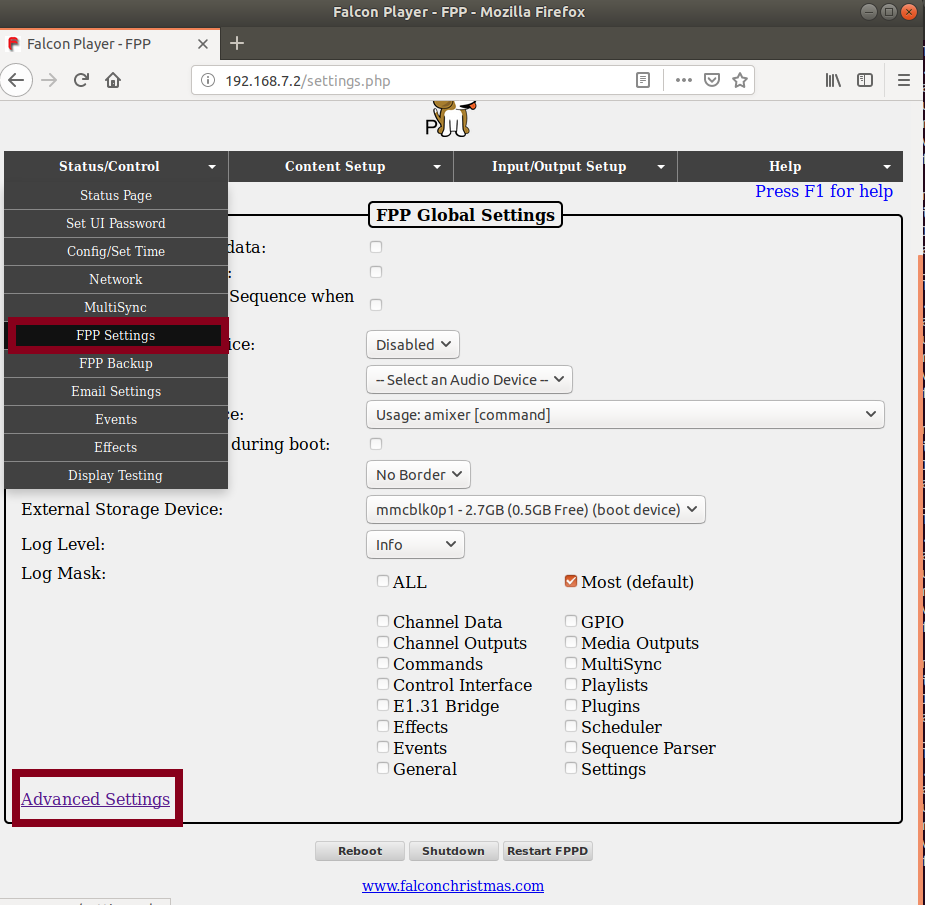
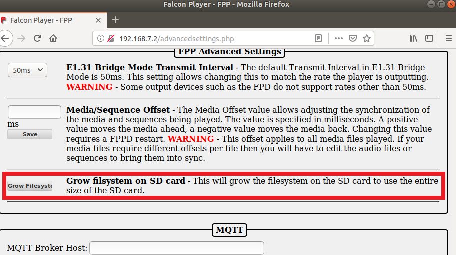

This folder contains our image that will work with our project. The other instructions are for setup from scratch and hurdles we had to figure out.

# Files
* PBB_Falcon.zip - the compressed file of the image file of the sd card.

# Install Current Image
If you want to just use what we did this is how to install and setup the falcon. **You must have a minmum of 8 GB micro SD card to use though.**

## Requirements
We used win32diskimager to make and write the sd card image. It can be found here: [https://sourceforge.net/projects/win32diskimager/](https://sourceforge.net/projects/win32diskimager/).

## Using Win 32 Disk Imager
Uncompress the zip file to extract the image.

Start the program and navigate to the sd card image using the drop down. Select the drive where the sd card is located.

Keep default settings then click write. Safely eject the sd card from windows then you are ready to go.

## Expand SD Size
By default we kept the image small to fit on most size sd cards. If you want more space plug in the sd card to falcon and plug it in to your computer. Navigate your webrowser to `192.168.7.2`.

Click the `Status\Control` -> `FPP Settings` on the web interface. Next click the `Advanced Settings` at the bottom of the page. Then click `Grow Filesystem`. See pictures below.

